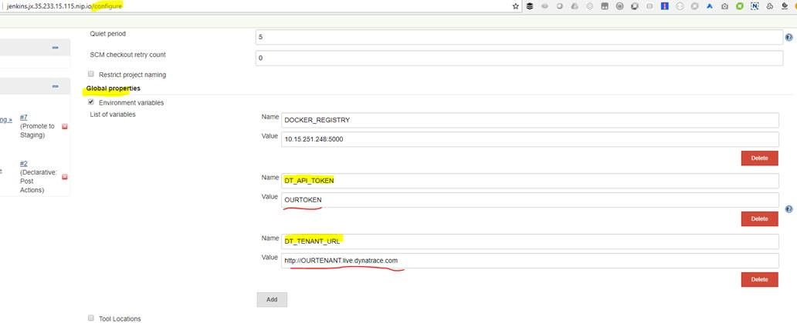
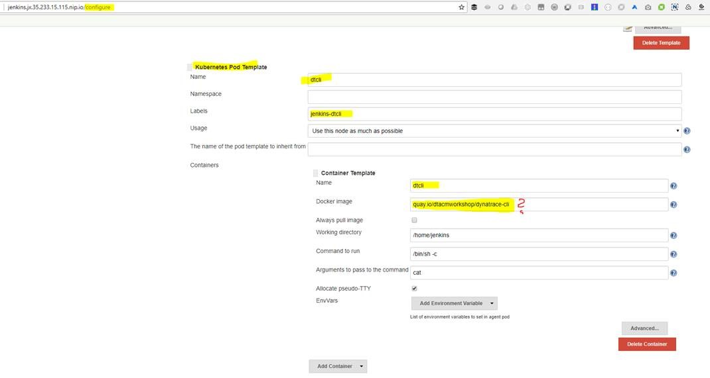
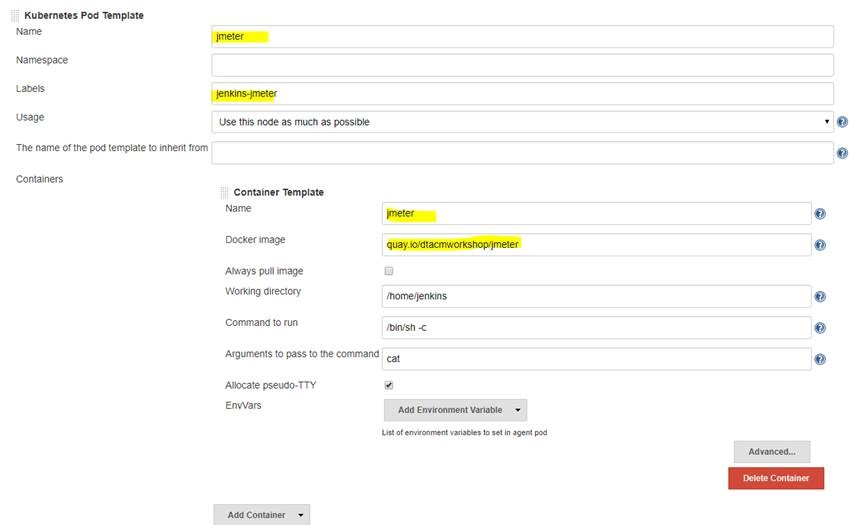
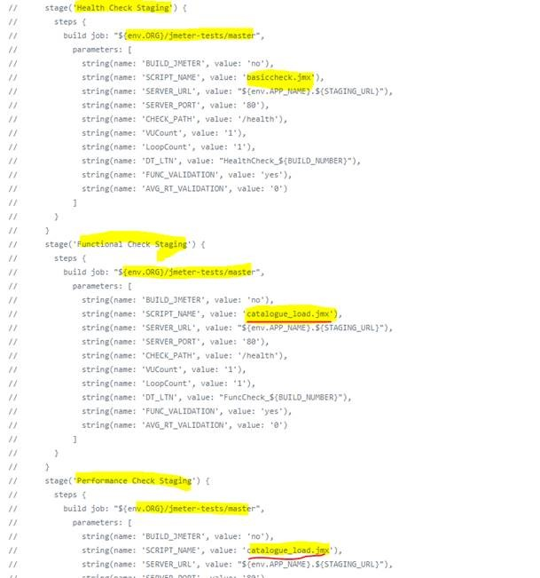
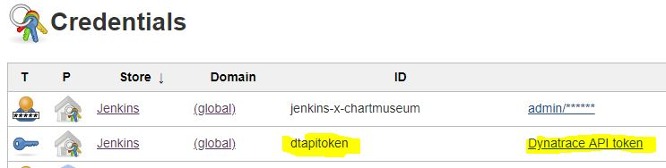
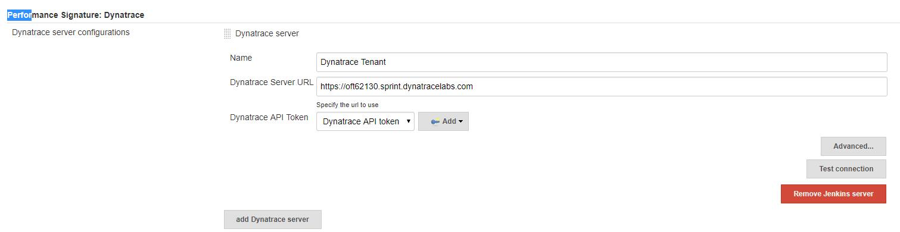
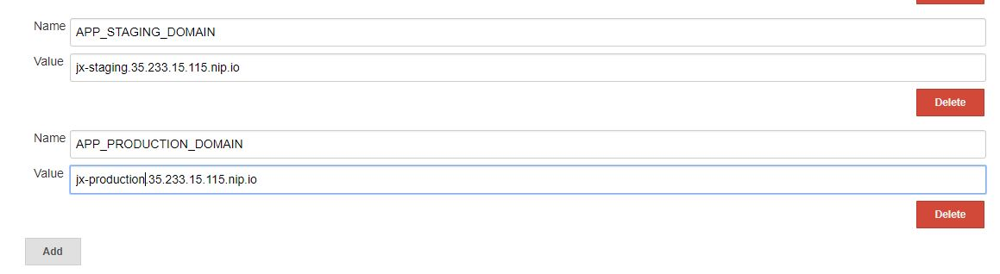

# Autonomous Cloud Labs - Docs
docs, instructions, additional material for autonomous cloud labs - Dynatrace Sockshop Workshop

# Enable Dynatrace DTCLI & JMeter on Jenkins-X

(instructions from Andi)

1. Add two global Jenkins Variables DT_API_TOKEN and DT_TENANT_ID
This is a general good practice to keep the token and tenant in Jenkins. Another option would be to define a so called "Credential" for the API TOKEN. The benefit of that woudl be that the credential will NEVER be logged out to a log file
For the moment - lets go with this though as shown on the screenshot:
  

1. Configure DTCLI Pod Template:
Right now we take the dtcli docker from our quay.io/dtacmworkshop repositories. For future discussion: a) do we want to keep it there and b) who is taking care of updates?
  

1. Configure JMeter Pod
Same as for JMeter
    

1. Calling JMeter tests
We will use the jmeter-tests pipeline to execute tests. All test scripts reside in that directory as well. See from the following screenshot how to call that script!
  
  
# Performance Report Plugin for Jenkins-X
The following plugin needs to be installed in order to generate nice reports for JMeter, JUnit, ... types of reports. Our pipelines will call the perfReport pipeline extension: https://plugins.jenkins.io/performance 

# Performance Signature in Jenkins-X
We also need the Performance Signature for Dynatrace Plugin which was developed by our partner T-Systems!

Simply install the following two plugins via Jenkins -> Manage Plugins 
* "Performance Signature: Dynatrace": https://plugins.jenkins.io/performance-signature-dynatracesaas
* "Performance Signature: Viewer" https://plugins.jenkins.io/performance-signature-viewer

Now we need to configure it
* Configure a Dynatrace API Credential
  
* Configure the plugin in the global settings and provide the Dynatrace Tenant Credentials
  - Give the configuration the name "Dynatrace Tenant" as this will be referenced in our Pipelines
  

# Application Domains as Variables in Jenkins-x

(from Andi)

For different tasks, e.g: Load or Functional Tests we need to construct the full URL to our deployed application.
In order not to hardcode the domain name I created two variables 
 
They can then be used in e.g: Jenkinsfiles like to construct service URLs, e.g: "${env.APP_NAME}.{APP_STAGING_DOMAIN}" -> which results e.g: in carts.jx-staging.35.233.15.115.nip.io

# jx cli for your local machine

How to configure jx cli on your local macine if you already have a kubectl installed and configured.

1. export the current context to be able to switch back  
   `kubectl config current-context`
1. Config kubectl with the jenkins-x cluster  
  `gcloud container clusters get-credentials dynatrace-jenkins-x --zone europe-west1-b --project sai-research`
1. Set default namespace to jx, there are (probabyly more than) two ways to do it:
  - Option a  
   `kubectl config set-context $(kubectl config current-context) --namespace=jx`
  - Option b    
    `jx context` and select the desired context  
    `jx ns jx` to set the namespace to jx

