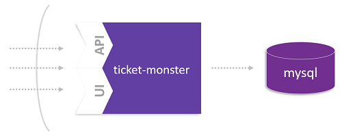

# Lift-and-shift TicketMonster to Cloud Platform

In this lab you'll learn how to move a monolithic application to a Cloud Platform, which is OpenShift. The applied moving approach follows a lift-and-shift concept. This means that the application will not be prepared for being Cloud-native, but rather taken as it is. Nevertheless, the database for the application will be service, which is running on OpenShift. 



## Step 1: Create the Database

1. Deploy a MySQL database service
   ```
   oc new-app -e MYSQL_USER=ticket -e MYSQL_PASSWORD=monster -e MYSQL_DATABASE=ticketmonster mysql:5.5
   ```

1. Get the IP of the service
   ```
   oc get svc
   ```

## Step 2: Deploy TicketMonster, the Monolith

1. Create a new application
   ```
   oc new-app -e MYSQL_SERVICE_HOST=mysql -e MYSQL_SERVICE_PORT=3306 --docker-image=dynatracesockshop/ticket-monster-monolith:latest
   ```

1. Expose the TicketMonster service
   ```
   oc expose service ticket-monster-monolith --name=monolith 
   ```

1. Test your TicketMonster

   Get the public endpoint of your ticketmonster application:
   ```
   oc get routes
   ```
   Open the route a browser and navigate through the application.
