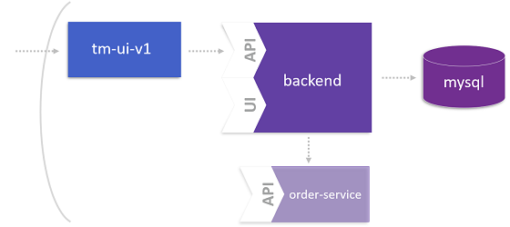

# Identify a Microservice using Dynatrace

In this lab you'll learn how to virtually break a monolithic application. For this task, Dynatrace provides the feature of **Custom service detection** that allows to define an entry point at which the monolith should be broken without touching any line of code.

For more details about this lab, please take a look at the following blog post: [Identifying a Microservice](https://www.dynatrace.com/news/blog/monolith-to-microservices-how-to-identify-your-first-microservice/)



## Step 1: Define custom service entry points
1. Login to the Dynatrace tenant: tenant-url (Please ask instructor for Dynatrace tenant and login credentials.)
1. Go to **Settings**, **Server-side service monitoring**, and click on **Custom service detection**.
1. Click on **Define Java service**, set name of custom service to `orders-service` and click **Find entry point**.
1. Select the process group that contains your entry point `ticketmonster-monolith` and click **Continue**.
1. Search for loaded classes and interfaces with name `BookingService`, select `org.jboss.examples.ticketmonster.rest.BookingService` and click **Continue**.
1. Select `createBooking` as entry point and click **Finish**.

## Step 2: Restart pods to activate custom service detection
1. Get your pods and copy the pod name starting with *ticketmonster-monolith*.
    ```
    (bastion)$ kubectl get pods -n ticketmonster

    NAME                                      READY   STATUS    RESTARTS   AGE
    ticketmonster-db-<your-pod-id>         1/1     Running   0          57m
    ticketmonster-monolith-<your-pod-id>   1/1     Running   0          49m
    ticketmonster-ui-<your-pod-id>         1/1     Running   0          28m
    ```

1. Delete the pod.
    ```
    (bastion)$ kubectl -n ticketmonster delete pod ticketmonster-monolith-<your-pod-id>

    pod "ticketmonster-monolith-<your-pod-id>" deleted
    ```

## Step 3: Book a ticket on TicketMonster
1. Open your **ticketmonster-ui** in a browser.
1. Click on **Events**, **Concerts** and on, e.g., **Rock concert of the decade**.
1. Select the **Venue**, **Date** and click on **Order ticket**.
1. Select tickets by choosing a section and the number of tickets.
1. **Checkout** your ticket booking after specifying your email.
1. Review your booking details.

## Step 4: Consider service flow in Dynatrace
1. Choose the **Transaction & services** tab from the left menu.
1. Select service **TicketMonsterUI**.
1. Click on **View service flow**.
1. Finally, you see the service flow containing the virtual microservice `orders-service`.


---

[Previous Step: Generate Load on UI](../4_Generate_Load_on_UI) :arrow_backward: :arrow_forward: [Next Step: Domain Model of Microservice](../6_Domain_Model_of_Microservice)

:arrow_up_small: [Back to overview](../)
