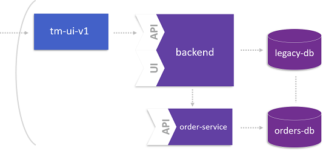

# Deploy the Microservice

In this lab ...



## Step 1: Prepare the Microservice

1. Switch to the `orders-service/` directory.

1. Edit the database connection strings in `\src\main\resources\application-mysql.properties`:
    ```properties
    spring.datasource.legacyDS.url=jdbc:mysql://<yourticketmonsterdb>:3306/ticketmonster?useSSL=false
    spring.datasource.legacyDS.username=ticket
    spring.datasource.legacyDS.password=monster
    spring.datasource.legacyDS.driverClassName=com.mysql.jdbc.Driver

    spring.datasource.ordersDS.url=jdbc:mysql://<yourorderdb>:3306/orders?useSSL=false
    spring.datasource.ordersDS.username=ticket
    spring.datasource.ordersDS.password=monster
    spring.datasource.ordersDS.driverClassName=com.mysql.jdbc.Driver
    ```

    You'll get this information with:
    ```
    oc get services
    ```

1. Build the application with Maven
    ```
    mvn clean install -P mysql,kubernetes fabric8:build -D docker.image.name=<yourdocker>/orders-service:latest -D skipTests
    ```

1. Build the Docker image in `\target\docker\<your dockerhub account>\orders-service\latest\build\`
    ```
    docker build . -t <yourdocker>/orders-service:latest
    ``` 

1. Push the application to Dockerhub
    ```
    docker push <yourdocker>/orders-service:latest
    ```

## Step 2: Deploy the Microservice

1. Create a new application in OpenShift
    ```
    oc new-app --docker-image=<yourdocker>/orders-service:latest
    ```

1. Expose your microservice
    ```
    oc expose service orders-service
    ```

By the end of this steps, you have the orders service in place. In order to actually call this service, set the according feature flag in your FF4J console.

## Step 3. Deploy a new backend version for the microservice
1. Make sure to replace XX with your assigned workshop number
    ```
    oc new-app -e ORDERS_SERVICE_IP=orders-service-wsXX.18.207.174.41.xip.io --docker-image=jetzlstorfer/backend-v2:latest
    oc expose service backend-v2 
    ```

1. We need to reroute the backend route to hit the new backend service
    ```
    oc set route-backends backend backend=0 backend-v2=100 
    ```

## Step 4: Switch feature flag and test your microservice

1. In your browser, navigate to your `ff4j` console: `https://<yourbackend<-XX.<ip>/ff4j-console` .
You will be able to switch on/off your new microservice from here. 

1. When making an order now the order will be operated and persisted by the OrderService instead of the monolithic booking service (in fact, the booking service calls the OrderService).

1. We can verify the service flow in Dynatrace. 

