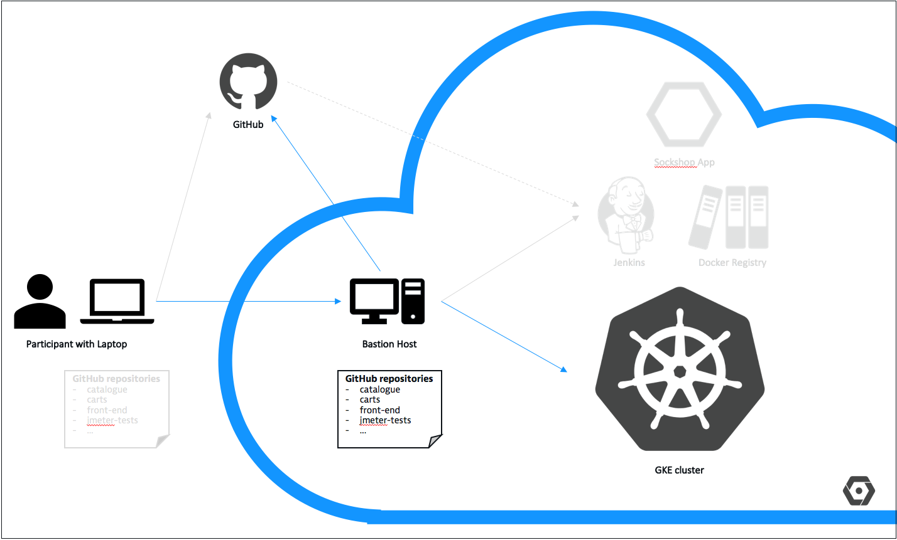

# Fork GitHub Repositories

## Overview



## Data needed
* GitHub organization
* GitHub user and email address and password

## Steps
1. Configure your git user name and email address.

    ```
    (bastion)$ git config --global user.name "<firstname> <lastname>"
    (bastion)$ git config --global user.eamil "<GitHubEmail>"
    ```

1. Execute the `~/forkGitHubRepositories.sh` script in your home directory. This script takes the name of the GitHub organization you have created in preparation for this workshop as a paramter.

    ```
    (bastion)$ ./forkGitHubRepositories.sh <GitHubOrg>
    ```

    This script `clone`s all needed repositories and the uses the `hub` command ([hub](https://hub.github.com/)) to fork those repositories to the passed GitHub organization. After that, the script deletes all repositories and `clone`s them again from the new URL.

1. Ensure that all repositories have been cloned in the `~/repositories' folder on the bastion host - we need them later.

    ```
    (bastion)$ ls -1 ~/repositories/
    carts
    catalogue
    front-end
    jmeter-tests
    load-test
    orders
    payment
    queue-master
    shipping
    shipping-rabbitmq
    user
    user-db
    ```

---

[Previous Step: Check Prerequisites](../1_Check_Prerequisites) :arrow_backward: :arrow_forward: [Next Step: Deploy Docker Registry](../3_Deploy_Docker_Registry)

:arrow_up_small: [Back to overview](../)