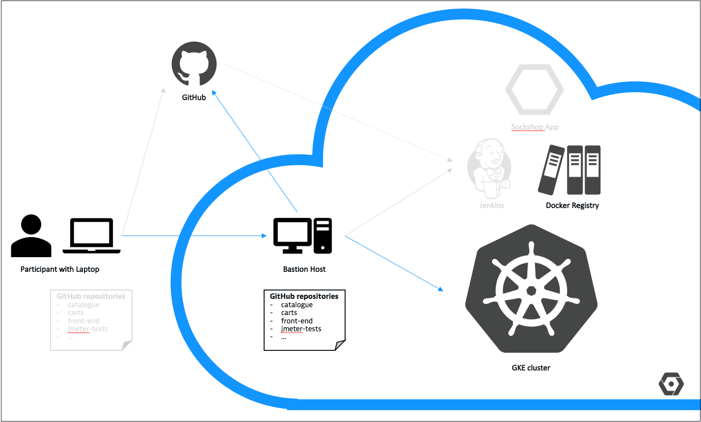

# Deploy Docker Registry

## Overview



## Data needed

(nil)

## Steps
1. In Preparation for deploying the Docker registry we're going to use throught the week, we want to create some Kubernetes namespaces (`~/manifests/k8s-namespaces.yml`):
    - `cicd`: hosts all CI/CD related pods and services
    - `dev`: represents the development stage
    - `stage`: represents the staging stage
    - `prod`: represents the production stage

    ```
    (bastion)$ kubectl create -f manifests/k8s-namespaces.yml
    ```

2. We specify that we want to have fast SSD storage by executing the following command (`~/manifests/k8s-storage.yml`):

    ```
    (bastion)$ kubectl create -f manifests/k8s-storage.yml
    ```

---

[Previous Step: Check Prerequisites](../2_Fork_GitHub_Repositories) :arrow_backward: :arrow_forward: [Next Step: Deploy Jenkins](../4_Deploy_Jenkins)

:arrow_up_small: [Back to overview](../)