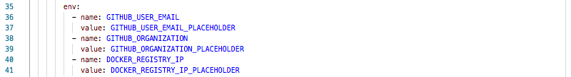
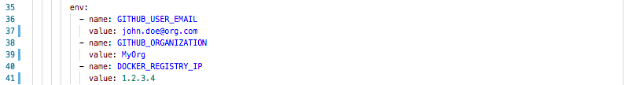
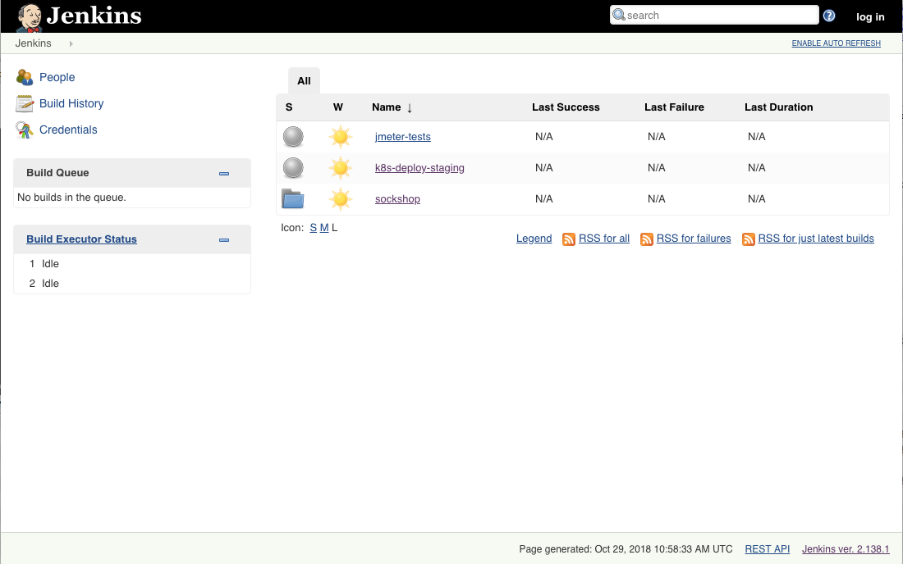
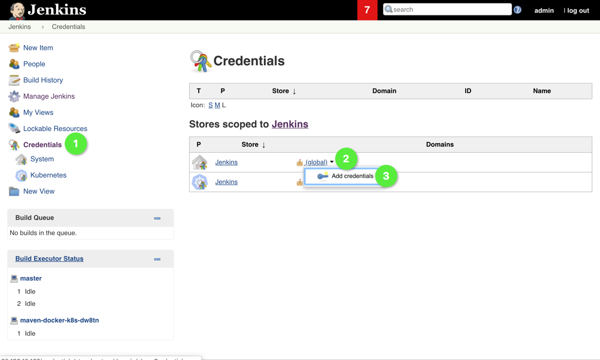
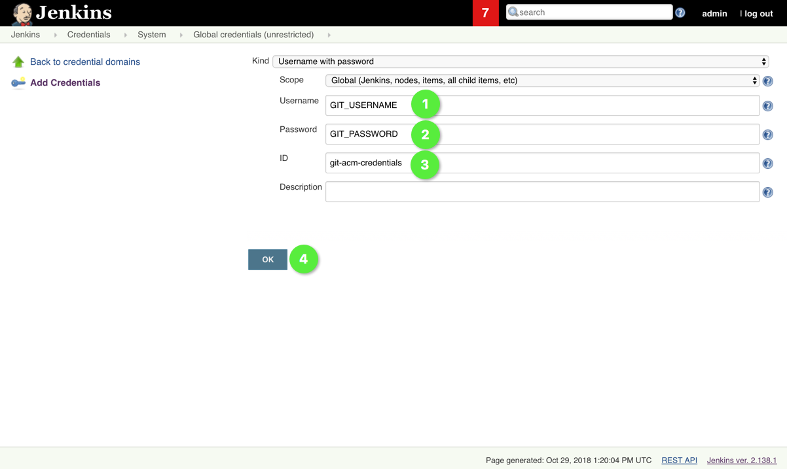

# Deploy Jenkins

Jenkins will be the CI/CD pipeline tool of choice for this workshop. We'll deploy Jenkins as a Kubernetes service and use persistent volumes for the workspace and jobs directory, so that these data is persisted, if the pod is restarted. Jenkins will subsequentially start a pod for each build that is triggered. To save bandwidth, we create one more persistent volume that acts as a maven cache volume and is mounted automatically in each pod that runs a maven build.

## Prerequisites

The Jenkins will be exposed on a high port (24711 in our example), so please make sure your network connection allows this. VPNs might cause troubles here and you won't be able to connect to your Jenkins instance later on.

## Data needed
* GitHub organization
* GitHub user email address
* Docker Registry IP address (from previous step)

## Steps
1. Jenkins will be the CI/CD pipeline tool of choice for this workshop. We'll deploy Jenkins as a Kubernetes service and use persistent volumes for the workspace and jobs directory, so that these data is persisted, if the pod is restarted. Jenkins will subsequentially start a pod for each build that is triggered. To save bandwidth, we create one more persistent volume that acts as a maven cache volume and is mounted automatically in each pod that runs a maven build.

1. Create Jenkins PVCs

    ```
    (bastion)$ kubectl create -f manifests-env-zero/k8s-jenkins-pvcs.yml
    ```

    Expected output:

    

1. Update the following values in the `manifests-env-zero/k8s-jenkins-deployment.yml` with following values:
    - your GitHub orginzation
    - the email address of your GitHub user
    - the IP address of the Docker registry we've deployed in the previous step
    - the Dynatrace tenant URL
    - an API Token form your Dynatrace tenant.

    

    After updating the file, it should look something like this.

    

1. Create the Jenkins service and deployment

    ```
    (bastion)$ kubectl create -f manifests-env-zero/k8s-jenkins-deployment.yml
    ```

    Expected output:

    

1. Ensure Jenkins service is deployed and get `EXTERNAL-IP` of Jenkins

    ```
    (bastion)$ kubectl -n cicd get services
    ```
 
    

1. Give Jenkins `clusteradmin` rights, so she can query for running pods and spawn pods when needed.

    ```
    (bastion)$ kubectl apply -f manifests-env-zero/k8s-jenkins-rbac.yml
    ```

1. Open `EXTERNAL-IP` in your browser and see the Jenkins UI with the preconfigured build pipelines for the Sockshop projects.

    

1. Login to Jenkins using the "log in" link in the upper right corner of the Jenkins UI with the credentials *admin*/*dynatrace123qweASD!*

    

1. For later use we configure Git credentials in Jenkins, so that selected pipelines can commit commit to Git with the provided credentials. Click "Credentials" :one: in the Jenkins UI, then the small black arrow next to "global", that shows when you put the mouse cursor over "global" :two:. Finally, click "Add credentials :three:.

    

1. Provide your Git username :one:, your [Personal Access token](https://github.com/settings/tokens/new) :two:, and the ID :three:.
    Please note that for the Personal Access Token, you can choose whatever name you like when creating it, for example "jenkins token". Please give this access token "Full control of private repositories".
    

    
    It's important to use this ID `git-credentials-acm`, as the credentials are referenced by this ID by selected builds. To save the credentials click OK :four:.

    

1. This concludes the setup and the configuration of Jenkins.

---

[Previous Step: Deploy Docker Registry](../3_Deploy_Docker_Registry) :arrow_backward: :arrow_forward: [Next Step: Trigger Build Pipeline](../5_Trigger_Build_Pipelines)

:arrow_up_small: [Back to overview](../)
