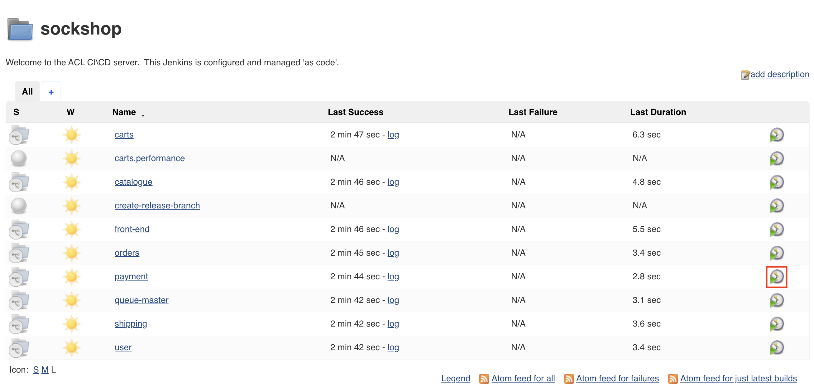

# Trigger Build Pipelines

In this lab, we'll confirm that the build pipelines to populate the `dev` namespace with all artifacts completed successfully.

## Steps

1. Navigate to the *Sockshop folder* in the Jenkins home page.

    

1. If all builds completed successfully, you should see something like this:

    

1. If there are any builds that failed, you will see a storm cloud next to the name of the job:

    

1. Execute the pipeline for that job again in case there are any failed builds by selecting the job and then executing the `master` branch:

    

1. This lab concludes, once all build pipelines have been run successfully.

---  

[Previous Step: Deploy Jenkins](../3_Deploy_Jenkins) :arrow_backward: :arrow_forward: [Next Step: Clone GitHub Repositories](../5_Clone_Gitea_Repositories)

:arrow_up_small: [Back to overview](../)
