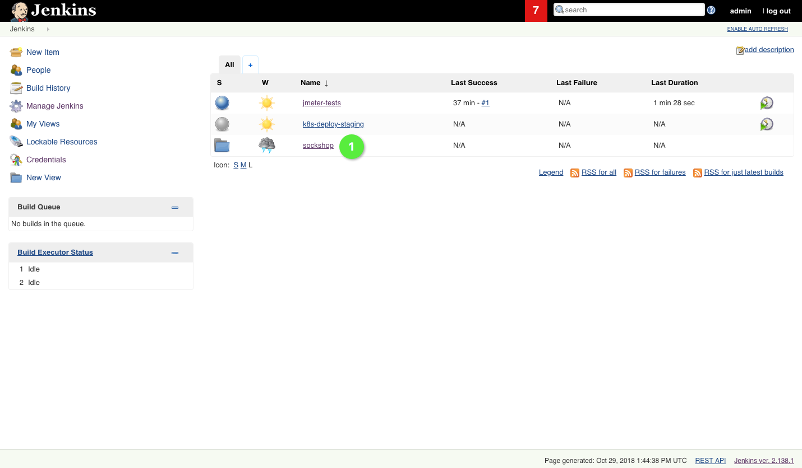
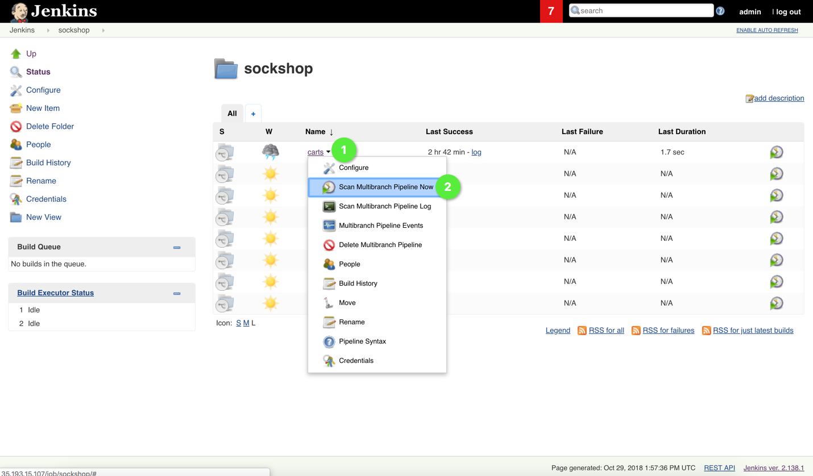

# Trigger Build Pipelines

In this lab, we'll prepare the `dev`, `staging`, and `production` namespaces in Kubernetes, so that the services find the infrastructure components that they need to work properly, i.e. the databases for certain services, and RabbitMQ. After that, we'll trigger all build pipelines to populate the `dev` namespace with all artifacts.

## Steps
1. Setup all databases and RabbitMQ executing the following command:

    ```
    (bastion)$ kubectl create -f repositories/sockshop-infrastructure/manifests/
    ```

    Verify the deployments have been successful in each of the namespaces using the following command

    ```
    (bastion)$ kubectl get deployment --all-namespaces | grep 'db\|rabbit'
    ```

1. To warm up Jenkins and to populate the `dev` namespace in Kubernetes with artifacts from Sockshop, we now trigger all build pipelines in the Sockshop folder in Jenkins. To that end, we enter the Sockshop folder :one: in the Jenkins UI.

    

1. You see a list of build pipeline. **For all of the pipelines** please click the icons in the rightmost column of the table that shows all build pipelines in the Sockshop folder. By doing that, Jenkins looks for active branches of the configured GitHub project and builds the found branches accordingly.

    

1. This step is concluded, once all build pipelines have been run successfully.

---

[Previous Step: Deploy Jenkins](../4_Deploy_Jenkins) :arrow_backward: :arrow_forward: [Next Step: Clone GitHub Repositories](../6_Clone_GitHub_Repositories)

:arrow_up_small: [Back to overview](../)
