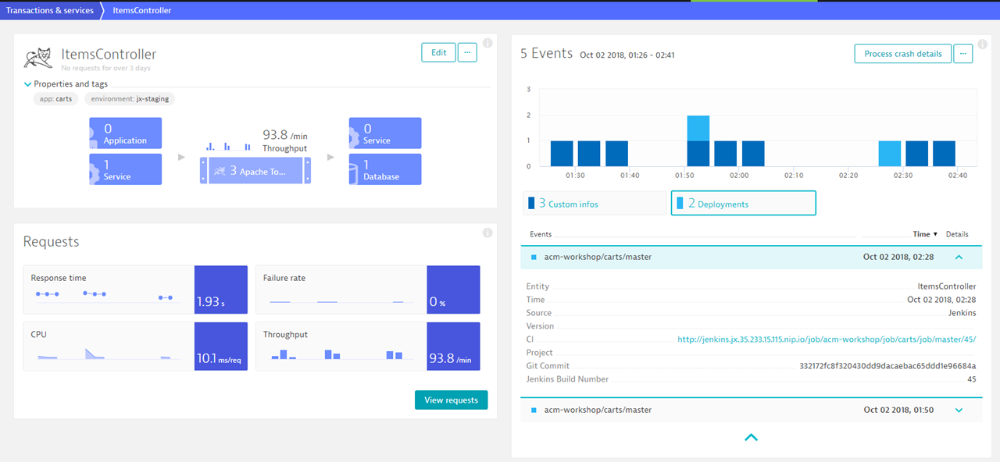

# Push Deployment & Configuration Change Events to Dynatrace

Passing meta-data is one way to enrich the meta-data in Smartscape and the automated PG, PGI and, Service detection/tagging. Additionally to meta data, you can also push deployment and configuration changes events to these Dynatrace entities. The Dynatrace Event API provides a way to either push a *Custom Annotation* or a *Custom Deployment Event* to a list of entities or entities that match certain tags. More on the [Dynatrace Event API can be found here](https://www.dynatrace.com/support/help/dynatrace-api/events/how-do-i-push-events-from-3rd-party-systems/).

In this lab you'll learn how to push deployment and configuration events to Dynatrace using the **Performance Signature Plugin** in Jenkins.

## Step 1: Performance Signature: Dynatrace in Jenkins
Before using the Performance Signature Plugin in build pipelines, it is necessary to configure it in Jenkins.
1. Go to **Jenkins** and click on **Manage Jenkins**.
1. Click on **Configure System** and scroll down to **Performance Signature: Dynatrace Saas/Managed**.
1. Select **add Dynatrace server** and for `Name` enter `Dynatrace Tenant` and then add your Dynatrace tenant URL.
1. Create a Dynatrace API Token by clicking on **Add** > **Jenkins** (Jenkins Credential Provider).
1. Select `Kind` as **Dynatrace API Token** and specify `ID` as `dynatraceToken`.
1. To retrieve the API token from Dynatrace:
    1. Go to **Settings**, **Integration**, and click on **Dynatrace API**.
    1. Click on **Generate token**, specify a name of the token (e.g. *jenkins_pipeline*) and click on **Generate**.
    1. Open the API Token and **Copy** the token to the clipboard.
1. Paste the copied token into `API Token` on the Jenkins popup and click on **Add**.
1. Select the newly created token from the dropdown menu.
1. Test connection by clicking on **Test connection**.
1. Finally, click **Save**.

    


## Step 2: Add additional Step to Carts Pipeline
To push deployment events to Dynatrace, extend the `Jenkinsfile` for `carts` service as follows:
1. Open the `Jenkinsfile` in the `~/repositories/carts` folder (Or edit the file directly on the GitHub carts repository within your Organization). 
1. Add the following stage after the **Deploy to dev namespace** stage.
    ```
    stage('DT Deploy Event') {
      when {
          expression {
          return env.BRANCH_NAME ==~ 'release/.*' || env.BRANCH_NAME ==~'master'
          }
      }
      steps {
        container("curl") {
          script {
            def status = pushDynatraceDeploymentEvent (
              tagRule : tagMatchRules,
              customProperties : [
                [key: 'Jenkins Build Number', value: "${env.BUILD_ID}"],
                [key: 'Git commit', value: "${env.GIT_COMMIT}"]
              ]
            )
          }
        }
      }
    }
    ```
1. Commit/Push the changes to your GitHub Repository *carts*.

## Step 3: Add additional Step to Staging Pipeline
Besides, it is necessary to update the staging pipeline to push deployment events for each service that gets deployed to the staging environment.

1. Open the `Jenkinsfile` in the `~/repositories/k8s-deploy-staging/` folder (Or edit the file directly on the GitHub k8s-deploy-staging repository within your Organization).
1. Add the following stage after the **Deploy to staging namespace** stage or uncomment exisiting **DT Deploy Event**.
    ```
    stage('DT Deploy Event') {
      steps {
        container("curl") {
          script {
            tagMatchRules[0].tags[0].value = "${env.APP_NAME}"
            def status = pushDynatraceDeploymentEvent (
              tagRule : tagMatchRules,
              customProperties : [
                [key: 'Jenkins Build Number', value: "${env.BUILD_ID}"],
                [key: 'Git commit', value: "${env.GIT_COMMIT}"]
              ]
            )
          }
        }
      }
    }
    ```
1. Commit/Push the changes to your GitHub Repository *k8s-deploy-staging*.

## Step 4: Verify the pushed Events in Dynatrace

1. Create another release branch for carts and verify it makes it to staging by successfully passing ```k8s-deploy-staging```.
1. Go to **Transaction & services**.
1. Click in **Filtered by** edit field.
1. Enter `environment` and select `dev`.
1. Select the service `carts` and open it.
1. You should now see the deployment event on the right side.



---

[Previous Step: Tagging of Services](../03_Tagging_and_Naming_of_Services) :arrow_backward: :arrow_forward: [Next Step: Define Management Zones](../05_Define_Management_Zones)

:arrow_up_small: [Back to overview](../)
