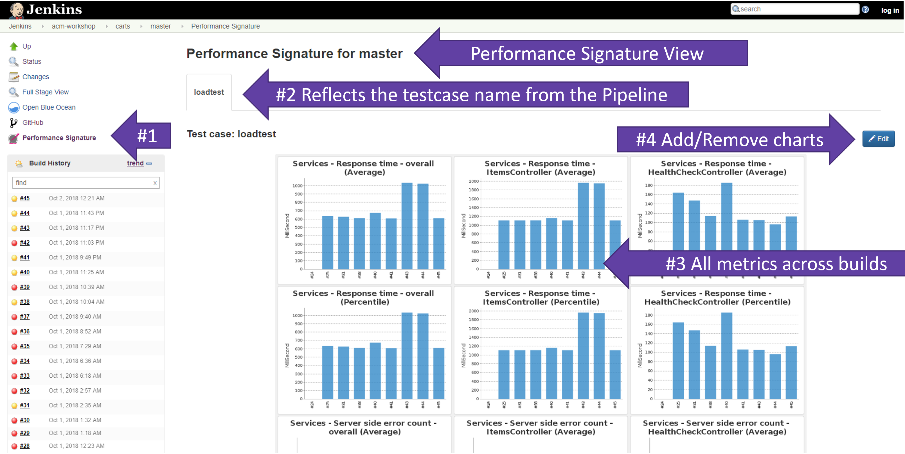

# Run Performance Test on Carts Service

In this lab you'll trigger a performance test for (1) the current implementation of carts and (2) a new version of the carts service. The new version of the carts intentionally contains a slow down of the service, which should be detected by the performance validation.

## Step 1: Run Performance Test on current Implementation
1. Go to  **Jenkins** and click on **sockshop** folder.
1. Click on **carts.performance** and select the **master** branch.  
1. Click on **Build Now** to trigger the performance pipeline.

## Step 2: Introduce a slowdown in the Carts Service
1. In the directory of `carts\`, open the file: `carts\src\main\resources\application.properties`.
1. Change the value of `delayInMillis` from `0` to `1000`.
1. Commit/Push the changes to your GitHub Repository *carts*.

## Step 3: Build this new Version
1. Go to your **Jenkins** and click on **sockshop** folder.
1. Click on **carts** and select the **master** branch.
1. Click on **Build Now** to trigger the performance pipeline.
1. Wait until the pipeline shows: *Success*.

## Step 4: Run Performance Test on new Version
1. Go to **Jenkins** and click on **sockshop** folder.
1. Click on **carts.performance** and select the **master** branch.  
1. Click on **Build Now** to trigger the performance pipeline.

## Step 4: Explore Results in Jenkins
1. After a successful pipeline execution, click on **Performance Trend**. 
This opens a trend analysis of the jMeter test results. In more details, it shows a chart for the throughput, response time, and percentage of errors as shown below.

1. Click on **Performance Signature**.
There you get an overview of the last builds similar to the screenshot below. 

1. Click on the **Build No** of one particular build and click on **Performance Signature**.
This opens a detailed view about the performance validation of the selected build. 

---

[Previous Step: Define Performance Pipeline](../04_Define_Performance_Pipeline) :arrow_backward: :arrow_forward: [Next Step: Compare Tests in Dynatrace](../06_Compare_Tests_in_Dynatrace)

:arrow_up_small: [Back to overview](../)