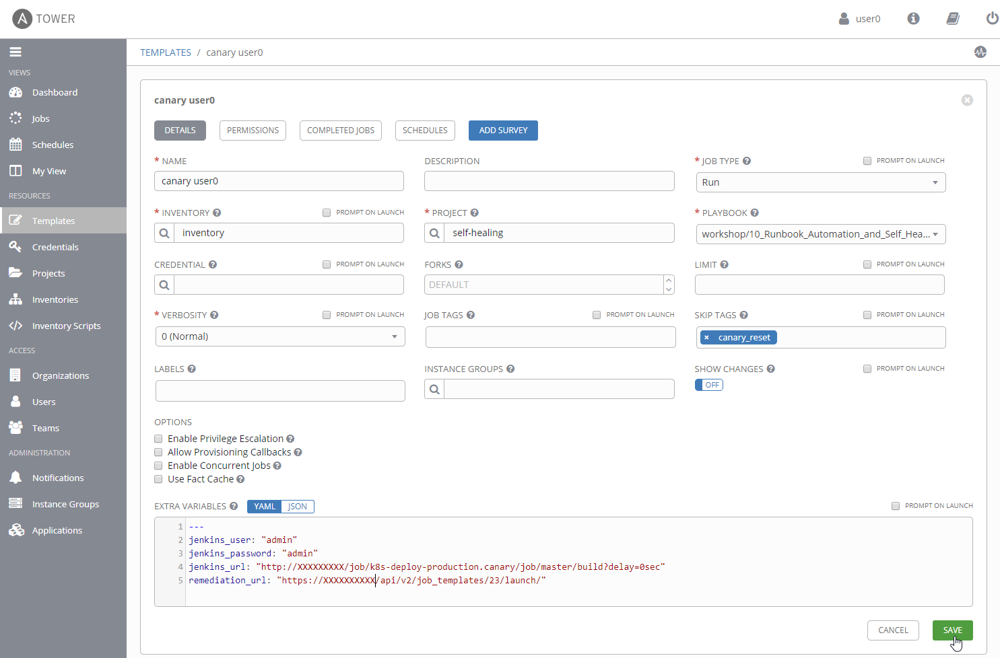
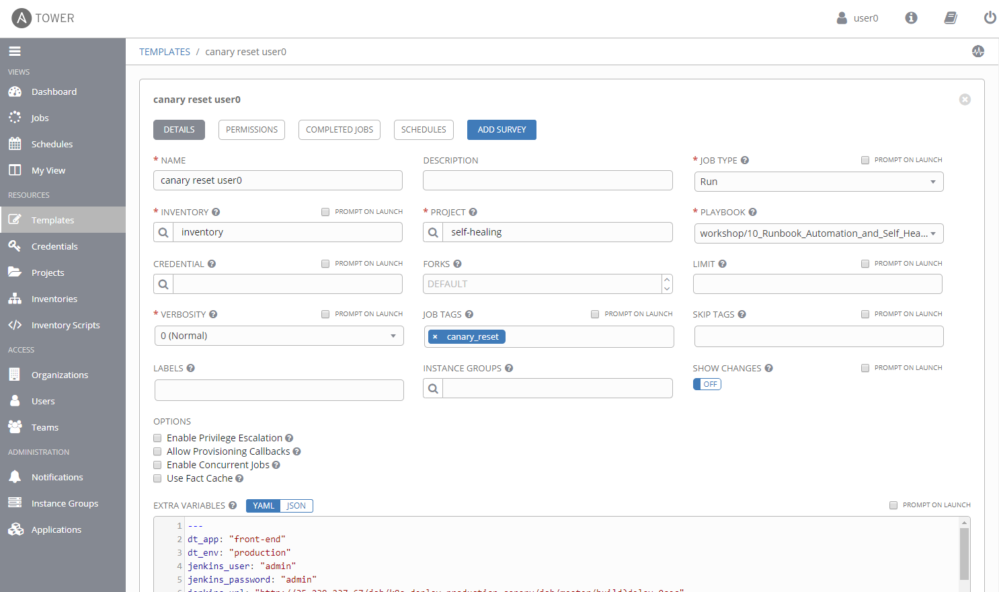

# LAB 1

In this lab you'll 

## Ansible Tower

1. Create **Job Template**
    - Name: canary userX
    - Job Type: run
    - Inventory: inventory
    - Project: self-healing
    - Playbook: workshop/10_.../canary.yml
    - Skip Tags: canary_reset
    - Extra Vars:
      ```
      ---
      jenkins_user: "admin"
      jenkins_password: "admin"
      jenkins_url: "http://XXXXXXXXX/job/k8s-deploy-production.canary/job/master/build?delay=0sec"
      remediation_url: "https://XXXXXXXX/api/v2/job_templates/XX/launch/"
      ``` 

    

1. Duplicate **Job Template**
    
    Duplicate the existing job template and change the following values
    - Name: canary reset userX
    - Job Tags: canary_reset
    - Skip Tags: remove the value 

    


1. Run **Job Template**

    Start the job template "canary user0" to trigger a canary release of version 2 of the front-end service.

