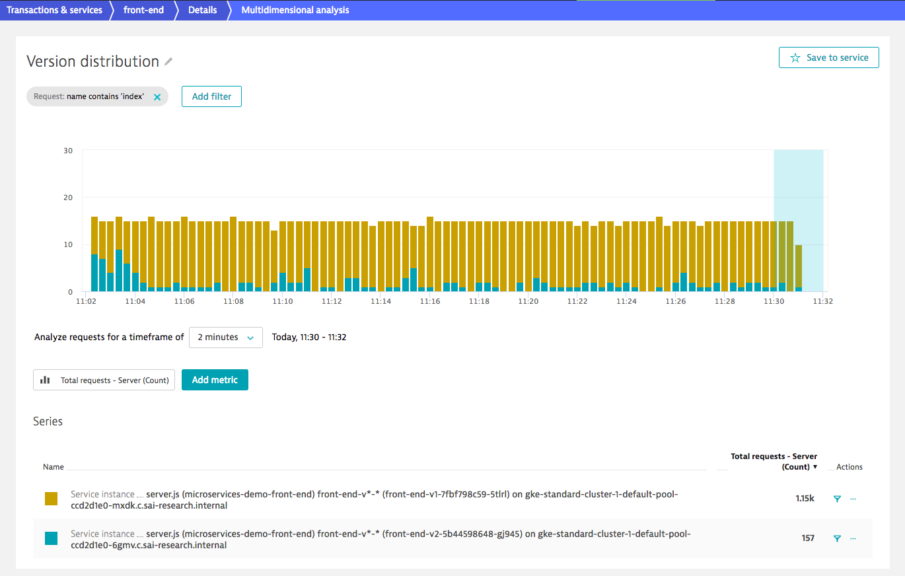

# Deploy front-end v2

In this lab, we'll configure traffic routing in Istio to redirect traffic based on different criteria to the version 2 of the `front-end`. We'll cover how to redirect traffic using weight rules, redirecting only logged in users to the version 2, and redirecting only Chrome users to version 2.

## Data needed
(nil)

## Steps
1. Right now, traffic to `front-end` is only routed to the version 1, because we've configured the `VirtualService` to do exactly that. The `subset: v1` entry in the configuration takes care of that.

    ```
    apiVersion: networking.istio.io/v1alpha3
    kind: VirtualService
    metadata:
    name: sockshop
    spec:
    hosts:
    - "*"
    gateways:
    - sockshop-gateway
    http:
    - route:
        - destination:
            host: front-end.production.svc.cluster.local
            subset: v1
    ```

1. To see if the new version works properly we only want 10% of the traffic to be redirected to that version initially. To that end, we modify the `virtual-service-canary.yml` in the `k8s-deploy-production` repository and apply it.

    ```
    (bastion)$ pwd
    ~/repositories/k8s-deploy-production/istio
    (bastion)$ vi virtual-service-canary.yml
    ...
    ```

    Edit the file like this:

    

    This configuration redirects 10% of all traffic hitting the sockshop `VirtualService` to version 2. Let's take a look how that looks in Dynatrace.

1. Open Dynatrace and navigate to Transactions&Services and open the `front-end` service screen.

    

    You see, that there are two service instances to the `front-end` service, i.e. the two different deployments we've done earlier, as you can see in the brackets of the processes (front-end-v1-... and front-end-v2-...). Dynatrace is aware of the two versions.

1. Let's create a chart in Dynatrace that shows the traffic distribution between two service versions. To that end, click on the "Create" button in the "Multidimensional analysis views" section on the service screen. In the next screen select the metric `Total requests - Server` and click "Build chart"

    

1. Rename the chart and configure the filter so only requests that contain the string `index` are taken into account for that chart. By doing that, we filter out the readiness and liveness probe requests.

    

1. Click on the metric :one: under the chart, select either "Stacked Area" or "Stacked Bar" chart :two:, and select "Service instance" as dimension :three:.

    

1. Your chart should now look something like this, already showing the traffic distribution between the two service instances.

    


---
[Previous Step: Deploy front-end v2](../5_Deploy_front-end_v2) :arrow_backward:

:arrow_up_small: [Back to overview](../)
