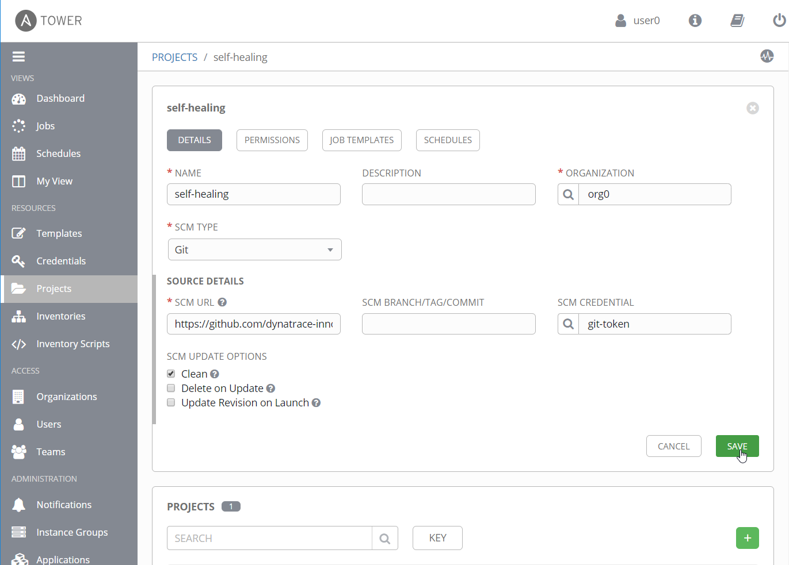
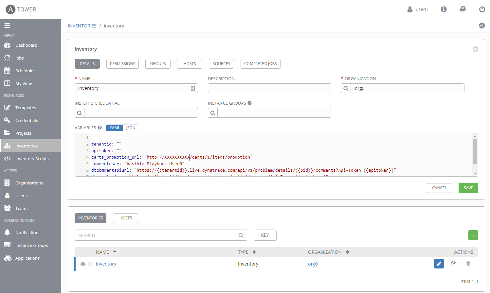
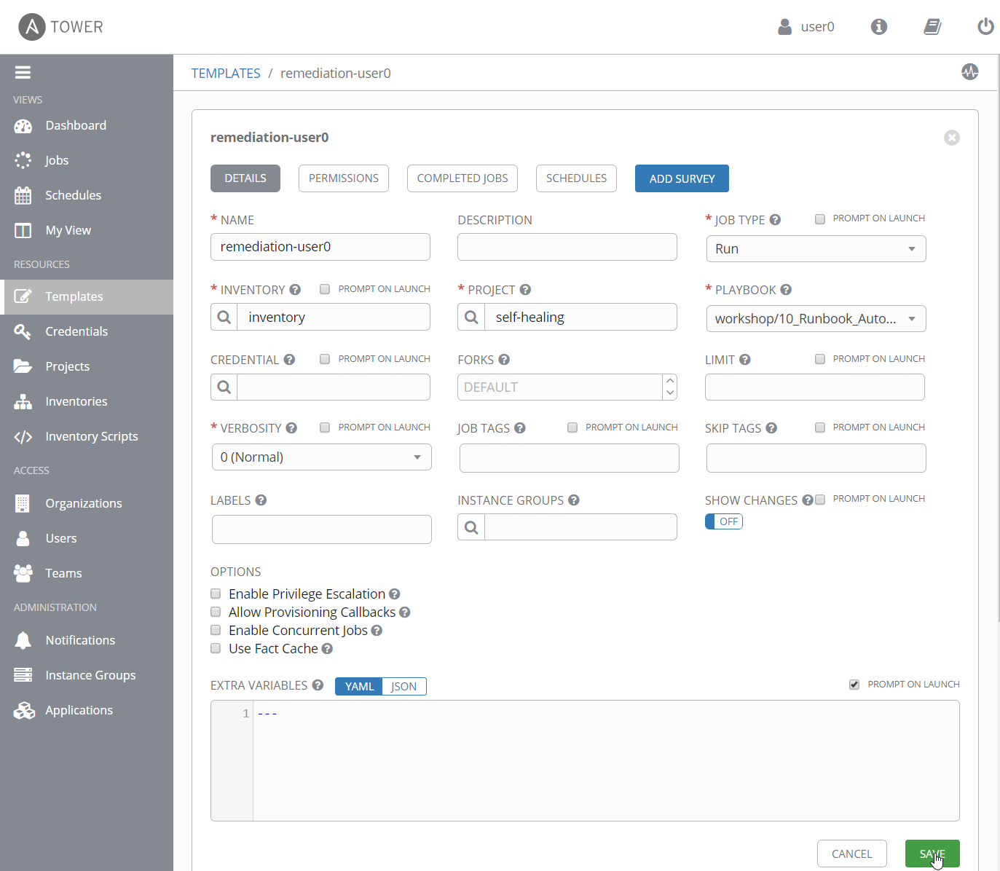
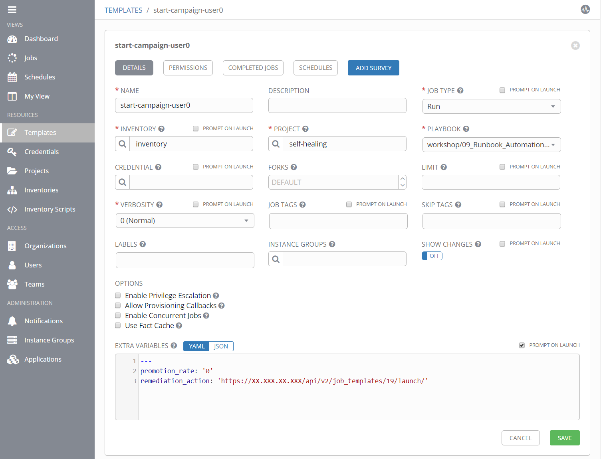

# Setup Ansible Tower

In this lab, we will setup and configure our Ansible Tower environment.
Therefore, we will have to 
- add Github credentials to be able to check out Github repository
- create a project in Ansible Tower that holds defines which repository to use
- create an inventory that holds additional information such as userdata and variables
- create job templates that can then be executed and will run our playbooks.

Let's get started! 

1. Login to the Ansible Tower with the credentials you received from your instructor.

1. Navigate to **Credentials** and add Git credentials to your Ansible Tower organization
    - Name: git-token
    - Credential Type: Source Control (click on magnifier and search for the correct type)
    - Type Details: your Github username and your password (password will be encrypted and can not be shown again once stored)

     

1. Navigate to **Project** and create a new project
    - Name: self-healing
    - SCM Type: Git
    - SCM Url: `https://github.com/dynatrace-innovationlab/acl-docs` (might be different for you workshop, please ask your instructor)
    - SCM Credential: git-token
    - SCM Update Options:
      - Check _Clean_: overwrite local changes each time you get latest SCM version

    

1. Navigate to **Inventory** and create a new inventory
    - Name: inventory
    - Variables: copy & paste the following snippet
      ```
      ---
      tenantid: "YOUR-TENANT"
      apitoken: "YOUR-API-TOKEN"
      carts_promotion_url: "http://SERVICE-URL/carts/1/items/promotion"
      commentuser: "Ansible Playbook"
      tower_user: "admin"
      tower_password: "dynatrace"
      dtcommentapiurl: "https://{{tenantid}}.live.dynatrace.com/api/v1/problem/details/{{pid}}/comments?Api-Token={{apitoken}}"
      dteventapiurl: "https://{{tenantid}}.live.dynatrace.com/api/v1/events/?Api-Token={{apitoken}}"
      ```

    Change all placeholders to your own actual values.

    

1. Navigate to **Templates** and create a new **Job Template** for the remediation playbook
    - Name: remediation-user0 <br>
      (_job template names have to be unique across the whole Ansible Tower installation so we just append an articial username in case we want to add more remedation playbooks later on_)
    - Job Type: Run
    - Inventory: inventory
    - Project: self-healing
    - Playbook: `09_Runbook_Automation_and_Self_Healing\playbooks\remediation.yaml`
    - Extra Variables: check box _Prompt on Launch_ 

    
    
1. Create a new **Job Template** for stopping the promotion campaign
    - Name: stop-campaign-user0 
    - Job Type: Run
    - Inventory: inventory
    - Project: self-healing
    - Playbook: `09_Runbook_Automation_and_Self_Healing\playbooks\campaign.yaml`
    - Extra Variables: check box _Prompt on Launch_ 
      ```
      ---
      promotion_rate: '0'
      remediation_action: 'https://XX.XXX.XX.XXX/api/v2/job_templates/XX/launch/'
      dt_application: 'carts'
      dt_environment: 'production'
      ```
      Make sure to adjust the values for the **IP address** (XX.XXX.XX.XXX) and the **job template ID** (XX). The **job template ID** you find in the current URL in your browser.

    
    
1. Create a new **Job Template** for starting the promotion campaign
    - Name: start-campaign-user0 
    - Job Type: Run
    - Inventory: inventory
    - Project: self-healing
    - Playbook: `09_Runbook_Automation_and_Self_Healing\playbooks\campaign.yaml`
    - Extra Variables: check box _Prompt on Launch_ 
      ```
      ---
      promotion_rate: '0'
      remediation_action: 'https://XX.XXX.XX.XXX/api/v2/job_templates/XX/launch/'
      dt_application: 'carts'
      dt_environment: 'production'
      ```
      Make sure to adjust the values for the **IP address** (XX.XXX.XX.XXX) and the **job template ID** (XX). For the **job template ID** you specify the ID of the *stop-campaign-userX* template. 

    

---
[Previous Step: Deploy Ansible Tower](../01_Deploy_Ansible_Tower) :arrow_backward: :arrow_forward: [Next Step: Setup Dynatrace](../03_Setup_Dynatrace)

:arrow_up_small: [Back to overview](../)
