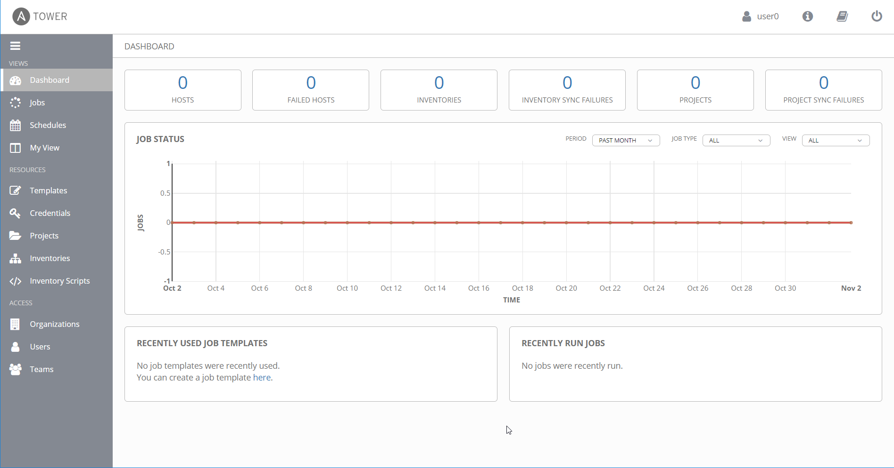

# Check Prerequisites

## Data needed

- You personal login for Ansible Tower
  - URL of Ansible Tower
  - User
  - Password

## Steps

1. If you don't have received your user credentials and connection information for the bastion host, please reach out to one of the instructors.
1. Use your favorite (or any other browser) to connect and login to Ansible Tower.
1. You should see the default Dashboard of Ansible Tower:

