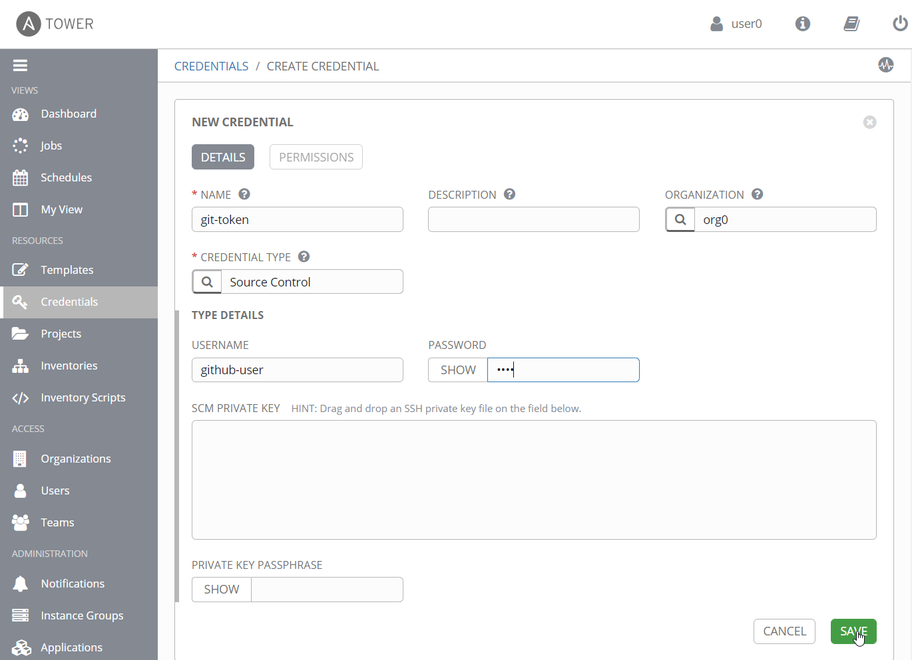
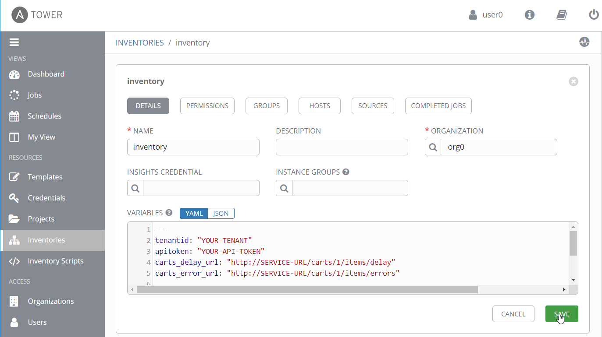
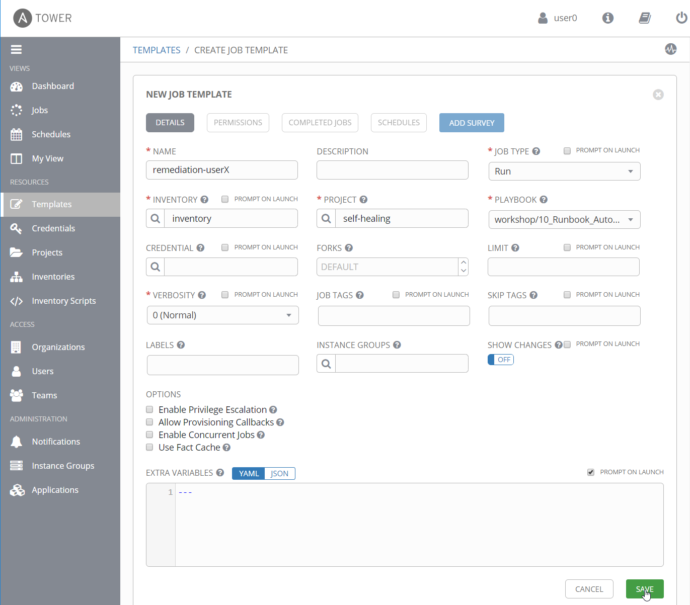

# Setup Ansible Tower

In this lab, we will setup and configure our Ansible Tower environment.
Therefore, we will have to 
- add Github credentials to be able to check out Github repository
- create a project in Ansible Tower that holds defines which repository to use
- create an inventory that holds additional information such as userdata and variables
- create job templates that can then be executed and that will run our playbooks.

Let's get started!

1. Navigate to **Credentials** and add Git credentials to your Ansible Tower organization
    - Name: git-token
    - Organization: orgX (X... your workshop user number)
    - Credential Type: Source Control (click on magnifier and search for the correct type)
    - Type Details: your Github username and your password (password will be encrypted and can not be shown again once stored)

     

1. Navigate to **Project** in Ansible Tower and create a new project
    - Name: self-healing
    - Organization: orgX (X... your workshop user number)
    - SCM Type: Git
    - SCM Url: `https://github.com/dynatrace-innovationlab/acl-docs`
    - SCM Credential: git-token
    - SCM Update Options:
      - Check _Clean_: overwrite local changes each time you get latest SCM version

    

1. Navigate to **Inventory** and create a new inventory
    - Name: inventory
    - Organization: orgX (X... your workshop user number)
    - Variables: copy & paste the following snippet
      ```
      ---
      tenantid: "YOUR-TENANT"
      apitoken: "YOUR-API-TOKEN"
      carts_delay_url: "http://SERVICE-URL/carts/1/items/delay"
      carts_error_url: "http://SERVICE-URL/carts/1/items/errors"
      
      commentuser: "Ansible Playbook"
      dtcommentapiurl: "https://{{tenantid}}.live.dynatrace.com/api/v1/problem/details/{{pid}}/comments?Api-Token={{apitoken}}"
      dteventapiurl: "https://{{tenantid}}.live.dynatrace.com/api/v1/events/?Api-Token={{apitoken}}"
      ```

      

1. Navigate to **Templates** and create a new Job Template
    - Name: remediation-userX (X... your workshop user number) <br>
      (_job template names have to be unique across the whole Ansible Tower installation_)
    - Job Type: Run
    - Inventory: inventory
    - Project: self-healing
    - Playbook: `10_Runbook_Automation_and_Self_Healing\playbooks\remediation.yaml`
    - Extra Variables: check box _Prompt on Launch_ 

    

