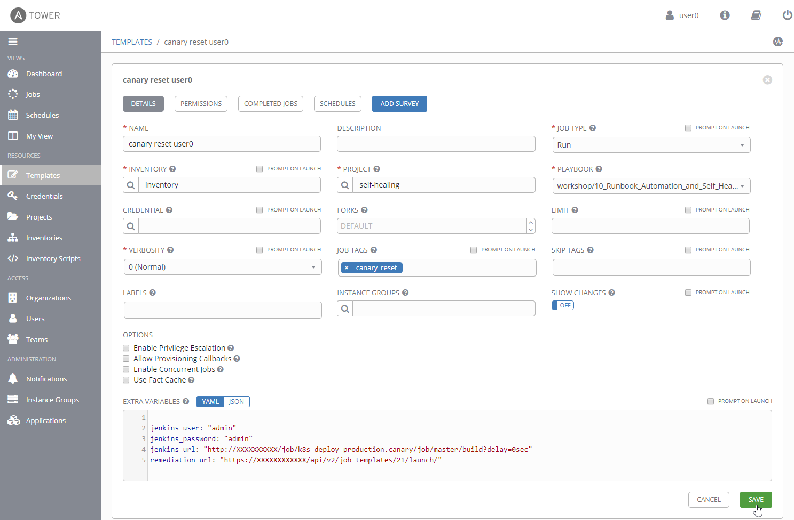

# Setup Self-Healing Action for Production Deployment

In this lab you'll create an Ansible Tower job that releases a deployment in a canary release manner. Additionally, you will create a second job that switches back to the old version in case the *canary* (i.e., the new version of front-end) behaves wrong. 

Prerequisites coming from module [Runbook Automation and Self-Healing](..\10_Runbook_Automation_and_Self_Healing): 
* *git-token* Credentials in Ansible Tower
* *self-healing* Project in Ansible Tower
* *inventory* in Ansible Tower

## Step 1: Create Job Template for Canary Release in Ansible Tower
1. Navigate to **Templates** and create a new Job Template for the canary release mechanism.
    - Name: `canary userX`
    - Job Type: `Run`
    - Inventory: `inventory`
    - Project: `self-healing`
    - Playbook: `workshop/10_.../canary.yml`
    - Skip Tags: `canary_reset`
    - Extra Variables:
      ```
      ---
      jenkins_user: "admin"
      jenkins_password: "admin"
      jenkins_url: "http://X.X.X.X/job/k8s-deploy-production.canary/build?delay=0sec"
      remediation_url: "https://X.X.X.X/api/v2/job_templates/XX/launch/"
      ``` 
    - Remarks:
        - The **X.X.X.X** in jenkins_url need to be replaced by the IP of your Jenkins.
        - The **X.X.X.X** in remediation_url need to be replaced by the IP of Ansible Tower.
        - The **XX** before /launch need to be replaced by the ID of the job created in the next step.


After this step, your job template for *canary userX*  should look as shown below: 


## Step 2: Duplicate Job Template for Self-Healing in Ansible Tower
1. Duplicate the existing job template and change the following values
    - Name: `canary reset userX`
    - Job Tags: `canary_reset`
    - Skip Tags: *remove the value* 

After this step, your job template for *canary reset userX* should look as shown below: 


# Troubleshooting
Some useful kubectl commands:
- `kubectl -n istio-system get pods`: get all pods in the Istio namespace
- `Kubectl -n istio-system delete pod **`: delete pod in the Istio namespace

---
[Previous Step: Simulate Early Pipeline Break](../02_Simulate_Early_Pipeline_Break) :arrow_backward: :arrow_forward: [Next Step: Simulate a Bad Production Deployment](../04_Introduce_a_Failure_into_Front-End)

:arrow_up_small: [Back to overview](../)
