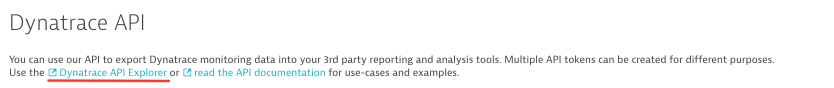

# Explore the Dynatrace API

Dynatrace provide extensive APIs for querying and manipulating data.
All API related information and documentation is located inside your Dynatrace environment under `Settings / Integration / Dynatrace API`.

## Creating an API token

To use the API, you first need an API token.

* On the current page by clicking `Generate token`.
* Select a name for the token. This name is only used to distinguish different tokens with different.scopes. Keep the other settings at their default and click on `Generate`.
* The newly created token will appear in the list below. To get it, click 'Edit'.
* Copy that token to a safe location - we will use it right away.

To browse the methods available, click on `Dynatrace API Explorer` link.
Next to it you also find a link to the complete API documentation.

## Authorizing the API

To use the API Explorer to test endpoints, these calls need to be authenticated with the token you just created.

* To authenticate the API, click on 'Authorize', paste the API token into all text fields  and click `Authorize` for each.

Now you can use the API explorer to test endpoints and explore the data returned.

## Exercises

Use the API Explorer and [the documentation](https://www.dynatrace.com/support/help/dynatrace-api/) to

1. fetch a list of hosts
2. fetch the details of a host from the list from step 1 and explore the details returned
3. fetch the CPU usage for a given host as timeseries
4. Fetch a list of all events within the last 24 hours

To perform a call, click on `try out` and then on `execute`.

---

:arrow_forward: [Next Step: Monitor Host Utilization](../3_Monitor_Host_Utilization)

:arrow_up_small: [Back to overview](../)
