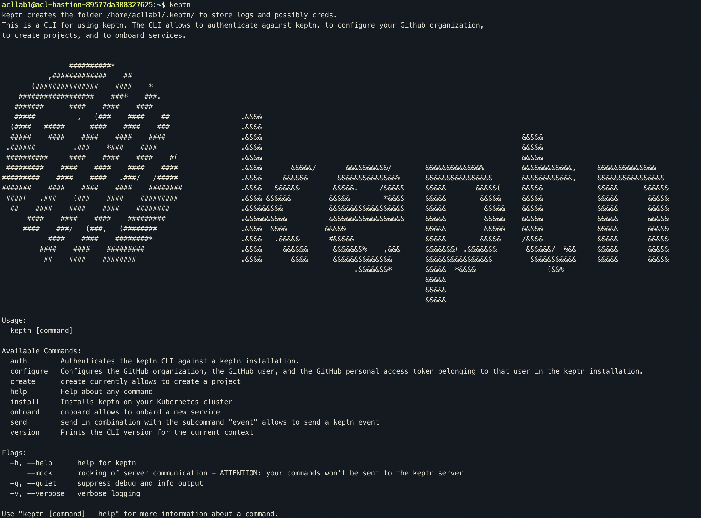
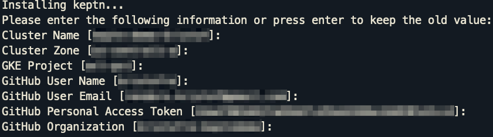
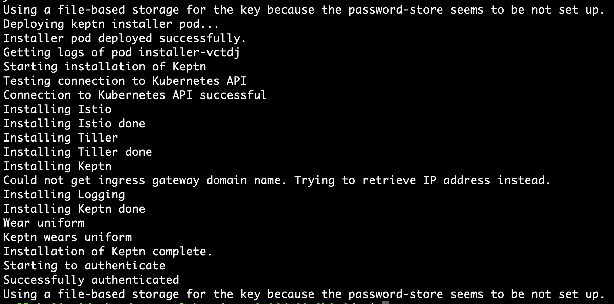

# Install keptn

In this lab you'll install the keptn runtime on your GKE cluster

## Step 1: Verify the keptn CLI has already been installed
1. Execute the following command to check the keptn CLI has been installed
    ```
    (bastion)$ keptn
    ```
1. You will be presented with a response like the following:



# Step 2: Install the keptn runtime
1. To install the keptn runtime on your cluster, execute the following command:
    ```
    (bastion)$ keptn install --platform=gke --istio-install-option=Overwrite
    ```
2. The installer will ask you for the following information:
    - Cluster name (should already be prefilled)
    - Cluster zone (should already be prefilled)
    - GKE project (should already be prefilled)



3. Confirm your entry. The keptn installation process will commence.



---

[Previous Step: Preparation](../00_Preparation) :arrow_backward: :arrow_forward: [Next Step: Configure Monitoring](../02_Configure_Monitoring)

:arrow_up_small: [Back to overview](../)
