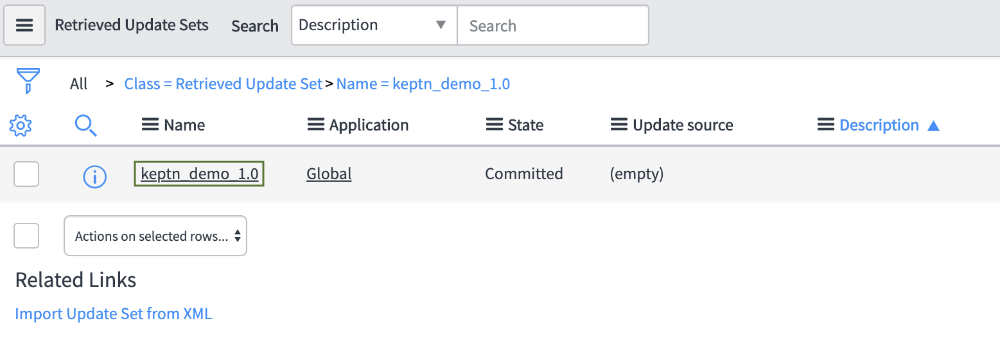
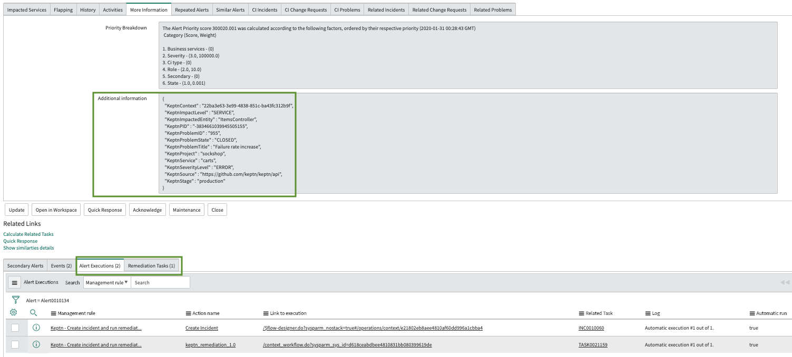

# Runbook Automation

Gives an overview of how to leverage the power of runbook automation to build self-healing applications. This tutorial uses ServiceNow workflows that trigger when open problem events from keptn are generated.

## About this tutorial

Configuration changes during runtime are sometimes necessary to increase flexibility. A prominent example are feature flags that can be toggled also in a production environment. In this tutorial, we will change the promotion rate of a shopping cart service, which means that a defined percentage of interactions with the shopping cart will add promotional items (e.g., small gifts) to the shopping carts of our customers. However, we will experience issues with this configuration change. Therefore, we will set logic in place that is capable of auto-remediating issues at runtime via ServiceNow workflows.

## Prerequisites

- Finish the [Onboarding a Service] tutorial. \
**Note:** For this tutorial, the Onboarding a Service tutorial has to be completed exactly as it is described. The scripts provided in the current tutorial rely on values that are set during the onboarding of the carts service. Thus, this tutorial might not work as expected if values are changed.
- If any of the [Self-healing] tutorials were completed, all the remediation files added as resources to the sockshop project in the production stage, will need to be deleted either locally or from the Git upstream.
- ServiceNow instance or free ServiceNow [developer instance]. \
**Note:** Tutorial tested on Madrid and New York releases.
- Event Management plugin (com.glideapp.itom.snac) needs to be enabled on ServiceNow instance. \
**Note:** To enable a plugin on a developer ServiceNow instance, visit the [Developer Portal] then go to **MANAGE -> instance** and click on the **Action** button and select **Activate plugin**. From the available plugins list click on **ACTIVATE** next to Event Management and then select **Activate plugin only**. The process will take a few minutes to complete.
- [Dynatrace setup] for monitoring is mandatory
- Clone the GitHub repository with the necessary files for the tutorial:

```
git clone --branch 0.2.0 https://github.com/keptn-contrib/servicenow-service.git --single-branch
cd servicenow-service
```

## Create ServiceNow secret

- Create a ServiceNow kubernetes secret to allow the ServiceNow keptn service to create events and update alerts in ServiceNow and trigger workflows.

- Create a file as shown below that contains your ServiceNow credentials and save it in your current directory as cred_file.yaml:

```
SERVICENOW_INSTANCE: {instance_id}.service-now.com
SERVICENOW_USER: your_servicenow_user
SERVICENOW_PASSWORD: your_servicenow_password
```

**Note:** The ServiceNow user needs to have the evt_mgmt_integration or admin role(s) assigned to it.

- Run the command below to create the ServiceNow secret:

```
kubectl create secret generic servicenow -n keptn --from-file=servicenow-credentials=cred_file.yaml
```

## Install the ServiceNow service on the keptn namespace

- Subscribe the servicenow-service to keptn sh.keptn.event.problem.open events by applying the distributor manifest:

```
cd deploy
kubectl apply -f distributor.yaml
```

- Deploy the servicenow-service by running the following command:

```
kubectl apply -f service.yaml
```

After running these commands, the servicenow-service and distributor are now deployed in your cluster. Execute the following commands to verify the deployment of the servicenow-service.

```
kubectl get svc servicenow-service -n keptn
```

```
NAME                 TYPE        CLUSTER-IP      EXTERNAL-IP   PORT(S)    AGE
servicenow-service   ClusterIP   10.51.246.134   <none>        8080/TCP   18m
```

```
kubectl get po -n keptn | grep "servicenow"
```

```
NAME                                                              READY   STATUS    RESTARTS   AGE
servicenow-service-5b67cc545c-c2452                               1/1     Running   0          17m
servicenow-service-open-problem-distributor-554b5d778b-vbmgv      1/1     Running   0          17m
```

## Configure ServiceNow for automated remediation

A ServiceNow Update Set is provided to run this tutorial. To install the Update Set follow these steps:

1. Login to your ServiceNow instance.
2. Type `update set` in the left filter navigator and go to **System Update Sets -> Update sets to Commit**


3. Click on Import Update Set from XML

4. Import and Upload the file keptn_remediation_1.0.xml from your file system that you find in your servicenow-service/usecase folder. 

5. Open the Update Set



6. In the right upper corner, click on Preview Update Set and once previewed, click on Commit Update Set to add the required configurations required for this tutorial to your instance.


**Note:** The update set will add an alert management rule named `keptn - Create incident and run remediation workflow` and a workflow: `keptn_remediation_1.0` to your instance on the global application scope.

7. After successfully committing the update set, add the required Dynatrace environment URL and api token necessary for the workflow to execute by completing the following steps:

    - On your ServiceNow instance, navigate to **Connections and Credentials -> Credentials**.
    - The same api token configured in the [Dynatrace setup] can be used for this tutorial.
    - Click on New and select Basic Auth Credentials. The name should be set to `dynatrace_keptn`, username is your Dynatrace environment URL and password is the dynatrace api token. Make sure that the Dynatrace environment URL follows the pattern `{your-domain}/e/{your-environment-id}` for a managed Dynatrace tenant or `{your-environment-id}.live.dynatrace.com` for a SaaS tenant.

8. Add the required keptn api URL and api token necessary for the workflow to execute by completing the following steps:

    - Run the following command to obtain the keptn api URL:
    ```
    echo api.keptn.$(kubectl get cm keptn-domain -n keptn -ojsonpath={.data.app_domain})
    ```
    - To obtain the keptn api token, the following command can be executed:
    ```
    echo $(kubectl get secret keptn-api-token -n keptn -ojsonpath={.data.keptn-api-token} | base64 --decode)
    ```
    - On your ServiceNow instance, navigate to **Connections and Credentials -> Credentials**.
    - Click on New and select Basic Auth Credentials. The name should be set to `keptn`, username is your keptn api URL and password is the keptn api token.


## Verify Dynatrace problem notification

During the [Dynatrace setup], a problem notification has already been set up for you. You can verify the correct setup by following the instructions:

Login to your Dynatrace tenant.
Navigate to Settings > Integration > Problem notifications
Click on Set up notifications and select Custom integration
Click on Keptn Problem Notification

The problem notification should look similar to the one in this screen shot:


## Adjust anomaly detection in Dynatrace

The Dynatrace platform is built on top of AI, which is great for production use cases, but for this demo we have to override some default settings in order for Dynatrace to trigger the problem.

Before you adjust this setting, make sure to have some traffic on the service in order for Dynatrace to detect and list the service. The easiest way to generate traffic is to use the provided file add-to-carts.sh in the ./usecase folder. This script will add items to the shopping cart and can be stopped after a couple of added items by hitting CTRL+C.

1. Navigate to the servicenow-service/usecase folder:

```
cd ../usecase
```

2. Run the script:

```
./add-to-cart.sh "carts.sockshop-production.$(kubectl get cm keptn-domain -n keptn -o=jsonpath='{.data.app_domain}')"
```

3. Once you generated some load, navigate to Transaction & services and find the service ItemsController in the sockshop-production environment.


4. In the section Anomaly detection override the global anomaly detection and set the value for the failure rate to use fixed thresholds and to alert if 10% custom failure rate are exceeded. Finally, set the Sensitiviy to High.


## Run the tutorial

Now all the pieces are in place to run the use case of a problem found in production. Therefore, we will start by generating some load on the carts service in our production environment. Afterwards, we will change the configuration of this service at runtime. This will cause an increase in failures in the carts service running in our production environment, dynatrace will detect the issue and using the custom problem notification we set up in Dynatrace, keptn will be informed about the problem and will forward it to the servicenow-service that in turn creates an alert in ServiceNow. This alert will trigger a workflow from the configured alert management rule that is able to remediate the issue at runtime. If the remediation workflow completes successfully, ServiceNow will send a configuration change event to keptn which in respoinse will redeploy the carts service and all currently configured tests will be executed against it. An incident will also be created that will be linked to the alert.

## Load generation

1. Run the script:

```
./add-to-cart.sh "carts.sockshop-production.$(kubectl get cm keptn-domain -n keptn -o=jsonpath='{.data.app_domain}')"
```

2. You should see some logging output each time an item is added to your shopping cart:

```
Adding item to cart...
{"id":"3395a43e-2d88-40de-b95f-e00e1502085b","itemId":"03fef6ac-1896-4ce8-bd69-b798f85c6e0b","quantity":73,"unitPrice":0.0}
Adding item to cart...
{"id":"3395a43e-2d88-40de-b95f-e00e1502085b","itemId":"03fef6ac-1896-4ce8-bd69-b798f85c6e0b","quantity":74,"unitPrice":0.0}
Adding item to cart...
{"id":"3395a43e-2d88-40de-b95f-e00e1502085b","itemId":"03fef6ac-1896-4ce8-bd69-b798f85c6e0b","quantity":75,"unitPrice":0.0}
```

## Configuration change at runtime

1. Open another terminal to make sure the load generation is still running and again, navigate to the servicenow-service/usecase folder.
1. The `DT_API_TOKEN` and the `DT_TENANT` need to be stored in an environment variable. Therefore, copy and paste the following commands to make sure that DT_TENANT stores a url that follows the pattern `{your-domain}/e/{your-environment-id}` for a managed Dynatrace tenant or `{your-environment-id}.live.dynatrace.com` for a SaaS tenant.

```
export DT_TENANT=$(kubectl get secret dynatrace -n keptn -o=jsonpath='{.data.DT_TENANT}' | base64 --decode)
export DT_API_TOKEN=$(kubectl get secret dynatrace -n keptn -o=jsonpath='{.data.DT_API_TOKEN}' | base64 --decode)
echo $DT_TENANT $DT_API_TOKEN
```

3. Run the script:

```
./enable-promotion.sh "carts.sockshop-production.$(kubectl get cm keptn-domain -n keptn -o=jsonpath='{.data.app_domain}')" 30
```
**Note:** The parameter 30 at the end, which is the value for the configuration change and can be interpreted as for 30 % of the shopping cart interactions a special item is added to the shopping cart. This value can be set from 0 to 100. For this use case the value 30 is just fine.

4. You will notice that your load generation script output will include some error messages after applying the script:

```
Adding item to cart...
{"id":"3395a43e-2d88-40de-b95f-e00e1502085b","itemId":"03fef6ac-1896-4ce8-bd69-b798f85c6e0b","quantity":80,"unitPrice":0.0}
Adding item to cart...
{"timestamp":1553686899190,"status":500,"error":"Internal Server Error","exception":"java.lang.Exception","message":"promotion campaign not yet implemented","path":"/carts/1/items"}
Adding item to cart...
{"id":"3395a43e-2d88-40de-b95f-e00e1502085b","itemId":"03fef6ac-1896-4ce8-bd69-b798f85c6e0b","quantity":81,"unitPrice":0.0}
```

## Problem detection by Dynatrace

Navigate to the ItemsController service by clicking on Transactions & services and look for your ItemsController. Since our service is running in three different environment (dev, staging, and production) it is recommended to filter by the `keptn_stage:production` to make sure to find the correct service.


When clicking on the service, in the right bottom corner you can validate in Dynatrace that the configuration change has been applied.


After a couple of minutes, Dynatrace will open a problem ticket based on the increase of the failure rate.


## Alert/Incident Generation & workflow execution by ServiceNow

The keptn problem notification configured in Dynatrace is sent out to keptn where the ServiceNow service is subscribed to open problem events. Thus, the ServiceNow service takes the event and creates a new alert in ServiceNow. In your ServiceNow instance, you can take a look at all alerts by navifating to **Event Management -> All alerts**. You should be able to see the newly created alert, click on it to view some details.


Other useful unformation can be found on the lower portion of the alert such as the additional information field, Alert Executions and Remediation Tasks.



After creation of the alert, an incident is generated and a workflow is triggered in ServiceNow as configured in the `Keptn - Create incident and run remediation workflow` alert management rule that has been setup during the import of the Update Set earlier. The workflow gathers the required credentials configured earlier, reaches out to Dynatrace to gets the remediation URL stored on the custom configuration event on the ItemsController service entity to then execute a web request against the remediation URL and in turn fix the problem detected. If all this runs successfully, the workflow will then make an API call to keptn notifying that there was a configuration change which in turn will redeploy the carts service in all stages and all currently configured tests will be executed against it. Finally, keptn will send event notifications to Dynatrace as part of the configuration change and Dynatrace will also close the problem once it detects that the failure rate on the ItemsController service dropped.

You can view the execution of the workflow by navigating to **Workflow -> Live Workflows -> All Contexts** on your ServiceNow instance and clicking on the started date next to the workflow version that appears as `keptn_remediation_1.0`


Once the workflow context record is open, click on `Show Workflow` under `Related Links`, you can confirm here that all the workflow steps completed successfully.


You can then go to the [keptn bridge] and check that keptn received the configuration change event:


Check the `ItemsController` service in the `production` stage in Dynatrace. After keptn has finished running the deployment of the carts service you should see the newly created events. The open problem in Dynatrace should automatically close a few minutes after the remediation workflow successfully completes and a comment will also show on the problem comments indicating that the workflow executed successfully:

**ItemsController Service events**


**Dynatrace Problem comments**


## Troubleshooting

- Please note that Dynatrace has a feature called Frequent Issue Detection enabled by default. This means, that if Dynatrace detects the same problem multiple times, it will be classified as a frequent issue and problem notifications won’t be sent out to third party tools. Therefore, the tutorial might not be able to be run a couple of times in a row. To disable this feature:

1. Login to your Dynatrace tenant.
1. Navigate to Settings > Anomaly detection > Frequent issue detection
1. Toggle the switch at Detect frequent issues within transaction and services

- To view the logs of the servicenow-service pod, you can run the following commands:

```
kubectl logs -l 'run=servicenow-service' -n keptn
```

```
{"result":{"Default Bulk Endpoint":"1 events were inserted"}}
{"result":{"Default Bulk Endpoint":"1 events were inserted"}}
{"timestamp":"2020-01-31T00:59:58.826021749Z","logLevel":"ERROR","message":"Received unexpected keptn event"}
{"level":"warn","ts":1580432398.8261862,"logger":"fallback","caller":"http/transport.go:337","msg":"got an error from receiver fn: %s","error":"Received unexpected keptn event"}
{"level":"warn","ts":1580432398.8262806,"logger":"fallback","caller":"http/transport.go:421","msg":"error returned from invokeReceiver","error":"Received unexpected keptn event"}
{"result":{"Default Bulk Endpoint":"1 events were inserted"}}
```

In ServiceNow you can take a look at the workflow activity by navidating to **Workflow -> Live Workflows -> All Contexts** and select the workflow context of the keptn_remediation_1.0 workflow, you can then look at the workflow log tab to further troubleshoot.

In case Dynatrace detected a problem before the ServiceNow secret was created in your Kubernetes cluster, the remediation will not work. Resolution:

1. Create the secret.
1. Restart the pod.

```
kubectl delete pod -l 'run=servicenow-service' -n keptn
```

[Onboarding a Service]: https://keptn.sh/docs/0.6.0/usecases/onboard-carts-service/
[keptn bridge]: https://keptn.sh/docs/0.6.0/usecases/onboard-carts-service/#send-new-artifacts-and-watch-keptn-doing-the-deployment
[Dynatrace setup]: https://keptn.sh/docs/0.6.0/reference/monitoring/dynatrace/#setup-dynatrace
[Developer Portal]: https://developer.servicenow.com/
[Self-healing]: https://keptn.sh/docs/0.6.0/usecases/self-healing-with-keptn/
[keptn_remediation_1.0.xml]: ./keptn_remediation_1.0.xml
[developer instance]: https://developer.servicenow.com/